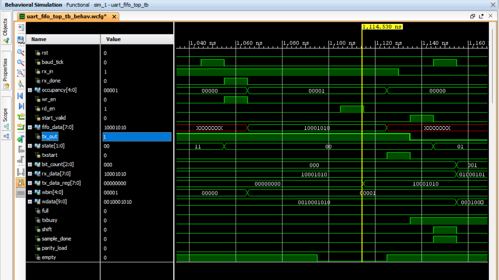

# UART Communication System with Asynchronous FIFO

## Overview

This project implements a complete UART communication system integrated with an Asynchronous FIFO using Verilog HDL. The design receives serial data through a UART Receiver, buffers it safely inside an Asynchronous FIFO, and retransmits it through a UART Transmitter.

The project demonstrates Clock Domain Crossing (CDC), Gray-code pointer synchronization, UART protocol implementation, FIFO control logic, and RTL verification using Vivado simulation.

---

## Features

- UART Receiver (8-bit Data)
- UART Transmitter
- Asynchronous FIFO
- Gray-Code Pointer Synchronization
- Full & Empty Flag Generation
- Almost Full & Almost Empty Flags
- FIFO Occupancy Counter
- Even Parity Support
- Start & Stop Bit Detection
- Modular RTL Design
- Complete Testbench Verification

---

## Block Diagram


---

## UART Receiver Architecture


---

## Asynchronous FIFO Architecture


---

## UART Transmitter Architecture


---

## Complete Data Flow


---

# Simulation Results

## UART Receiver


The UART Receiver correctly detects the Start bit, samples the incoming serial data, verifies parity and stop bit, and generates the received 8-bit parallel data with an `rx_done` pulse.

---

## FIFO Write Operation


When `rx_done` becomes high, the received byte is written into the FIFO. The write pointer increments, occupancy updates, and the Empty flag is cleared.

---

## FIFO Read Operation


Once the transmitter is available, the FIFO read enable is asserted. The stored data is read successfully, and the read pointer advances.

---

## UART Transmitter Start


The transmitter receives the `txstart` pulse, enters the START state, and loads the parallel data into the PISO shift register.

---

## UART Transmitter Data Transmission


The transmitter serializes the data, appends the parity bit and stop bit, and transmits the UART frame correctly.

---

## Complete System Waveform



The complete communication flow:
- UART RX receives serial data
- Data is stored into the Asynchronous FIFO
- FIFO buffers the data
- UART TX reads from FIFO
- Serial data is transmitted successfully

---

# Repository Structure

```
UART-Communication-System-with-Asynchronous-FIFO
│
├── RTL Source Files
├── Testbench
├── images
├── waveforms
├── README.md
├── LICENSE
└── .gitignore
```

---

# Tools Used

- Verilog HDL
- Xilinx Vivado
- RTL Simulation
- UART Protocol
- Asynchronous FIFO
- Clock Domain Crossing (CDC)

---

# Future Improvements

- Independent Read/Write Clock Verification
- Configurable Baud Rate
- FIFO Overflow & Underflow Error Reporting
- Parameterized UART Frame Format
- AXI/UART Interface Extension

---

# License

This project is licensed under the MIT License.
