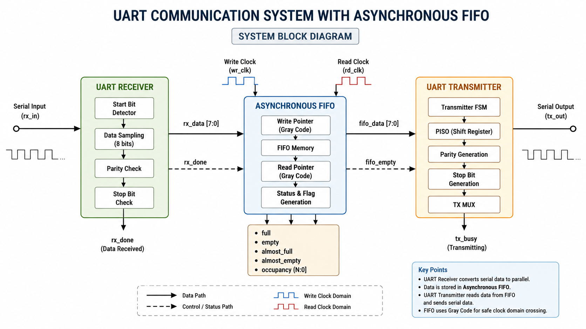
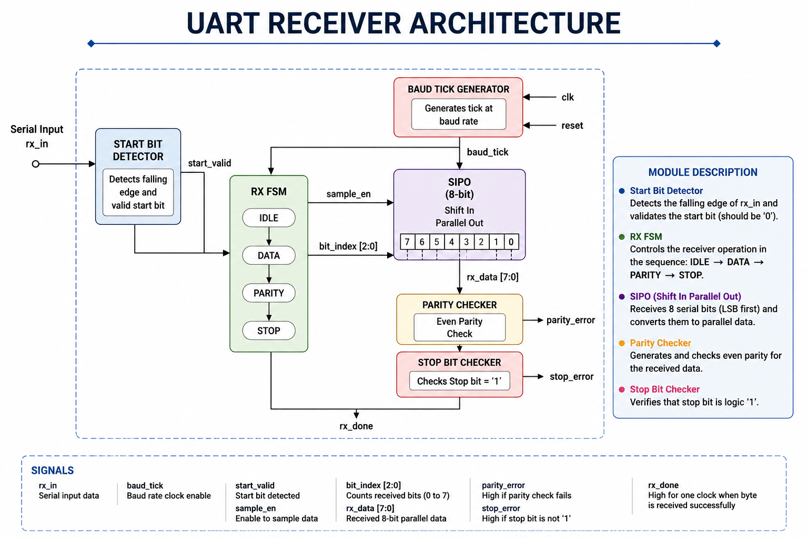
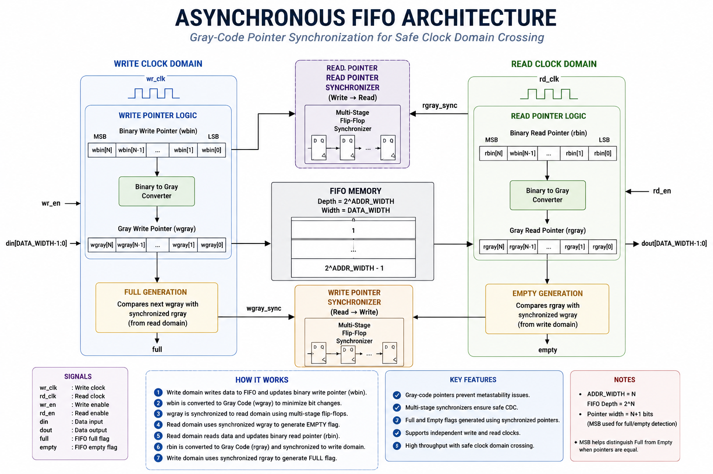
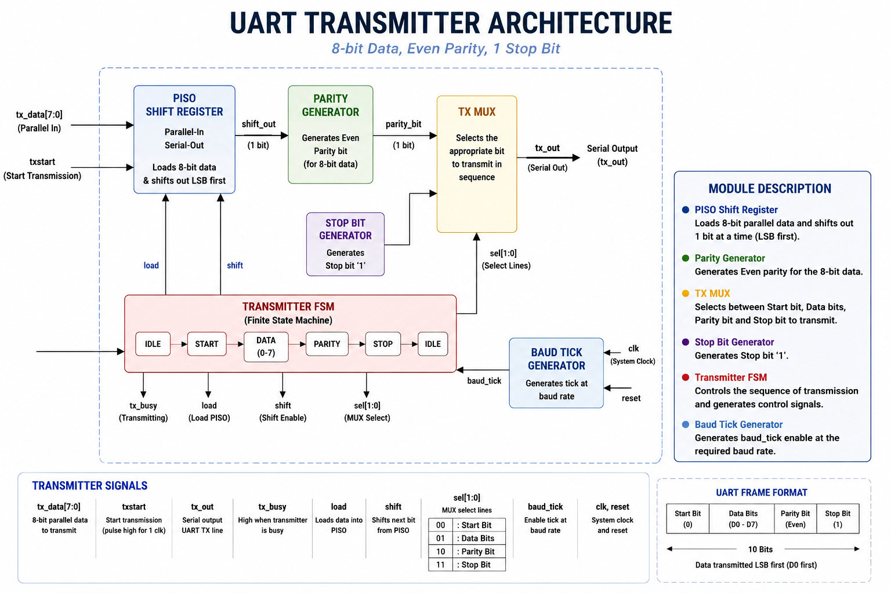
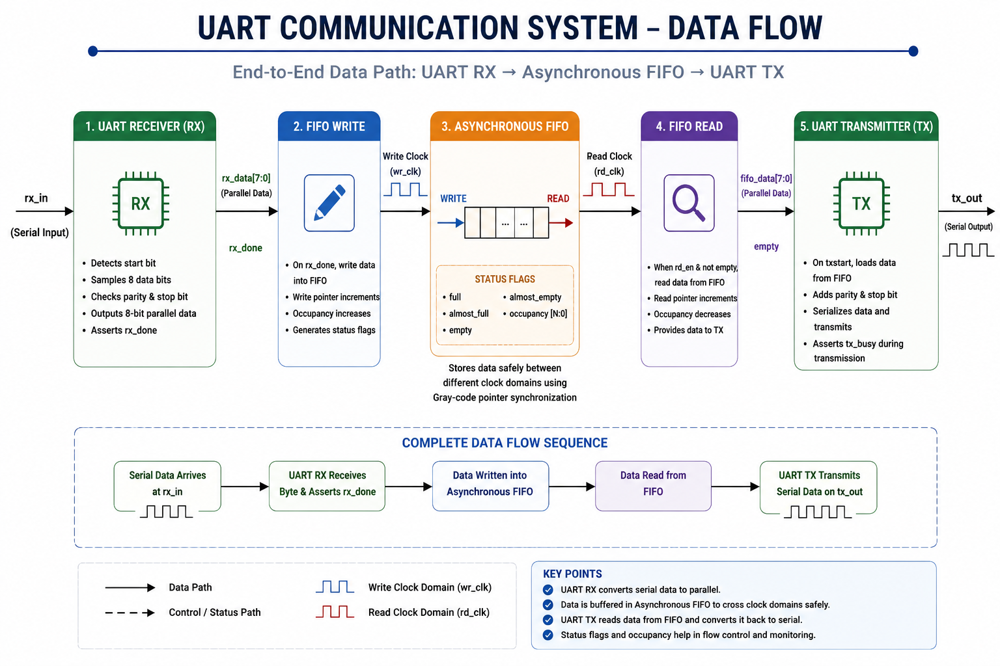

# UART Communication System with Asynchronous FIFO

## Overview

This project implements a complete UART communication system integrated with an Asynchronous FIFO using Verilog HDL. The design receives serial data through a UART Receiver, buffers it safely inside an Asynchronous FIFO, and retransmits it through a UART Transmitter.

The project demonstrates Clock Domain Crossing (CDC), Gray-code pointer synchronization, UART protocol implementation, FIFO control logic, and RTL verification using Vivado simulation.

---

## Features

- UART Receiver (8-bit Data)
- UART Transmitter
- Asynchronous FIFO
- Gray-Code Pointer Synchronization
- Full & Empty Flag Generation
- Almost Full & Almost Empty Flags
- FIFO Occupancy Counter
- Even Parity Support
- Start & Stop Bit Detection
- Modular RTL Design
- Complete Testbench Verification

---
## Block Diagram

<p align="center">
  
</p>

The overall system integrates a **UART Receiver**, **Asynchronous FIFO**, and **UART Transmitter** to achieve reliable serial communication across different clock domains. Incoming serial data is converted to parallel format, buffered safely in the FIFO, and transmitted back serially without data corruption.

---

## UART Receiver Architecture

<p align="center">
  
</p>

The UART Receiver samples the incoming serial data using an oversampled baud clock. It detects the **Start bit**, shifts in the eight data bits, optionally verifies the parity bit, checks the **Stop bit**, and generates an `rx_done` pulse along with the received parallel byte. This ensures accurate data reception even without a shared clock between transmitter and receiver.

---

## Asynchronous FIFO Architecture

<p align="center">
  
</p>

The Asynchronous FIFO acts as a buffer between two independent clock domains. It uses **dual-port RAM**, **Gray-code read/write pointers**, and **two-stage synchronizers** to safely transfer data while avoiding metastability. Status flags such as **Full**, **Empty**, **Almost Full**, and **Almost Empty** provide reliable flow control.

---

## UART Transmitter Architecture

<p align="center">
  
</p>

The UART Transmitter converts parallel data into a serial stream. A finite state machine (FSM) controls the transmission sequence by sending the **Start bit**, **8 data bits**, **parity bit**, and **Stop bit** at the configured baud rate. Transmission begins only when valid data is available from the FIFO.

---

## Complete Data Flow

<p align="center">
  
</p>

The complete communication flow begins when serial data is received by the UART Receiver. After successful reception, the data is written into the Asynchronous FIFO, where it is safely buffered across clock domains. Once the transmitter is ready, the FIFO provides the stored data to the UART Transmitter, which serializes and transmits it. This architecture ensures reliable communication between modules operating at different clock frequencies while preventing data loss and synchronization issues.

---
# Simulation Results

## UART Receiver


The UART Receiver correctly detects the Start bit, samples the incoming serial data, verifies parity and stop bit, and generates the received 8-bit parallel data with an `rx_done` pulse.

---

## FIFO Write Operation


When `rx_done` becomes high, the received byte is written into the FIFO. The write pointer increments, occupancy updates, and the Empty flag is cleared.

---

## FIFO Read Operation


Once the transmitter is available, the FIFO read enable is asserted. The stored data is read successfully, and the read pointer advances.

---

## UART Transmitter Start


The transmitter receives the `txstart` pulse, enters the START state, and loads the parallel data into the PISO shift register.

---

## UART Transmitter Data Transmission


The transmitter serializes the data, appends the parity bit and stop bit, and transmits the UART frame correctly.

---

## Complete System Waveform


The complete communication flow:
- UART RX receives serial data
- Data is stored into the Asynchronous FIFO
- FIFO buffers the data
- UART TX reads from FIFO
- Serial data is transmitted successfully

---

# Repository Structure

```
UART-Communication-System-with-Asynchronous-FIFO
│
├── RTL Source Files
├── Testbench
├── images
├── waveforms
├── README.md
├── LICENSE
└── .gitignore
```

---

# Tools Used

- Verilog HDL
- Xilinx Vivado
- RTL Simulation
- UART Protocol
- Asynchronous FIFO
- Clock Domain Crossing (CDC)

---

# Future Improvements

- Independent Read/Write Clock Verification
- Configurable Baud Rate
- FIFO Overflow & Underflow Error Reporting
- Parameterized UART Frame Format
- AXI/UART Interface Extension

---

# License

This project is licensed under the MIT License.
